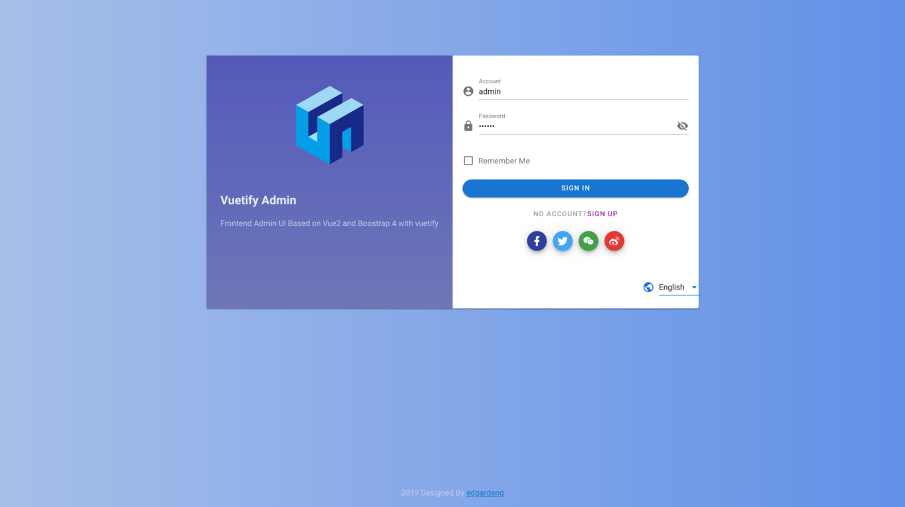
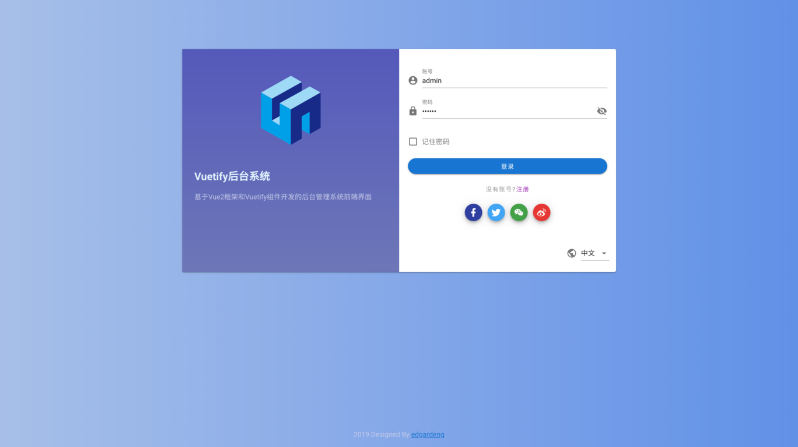
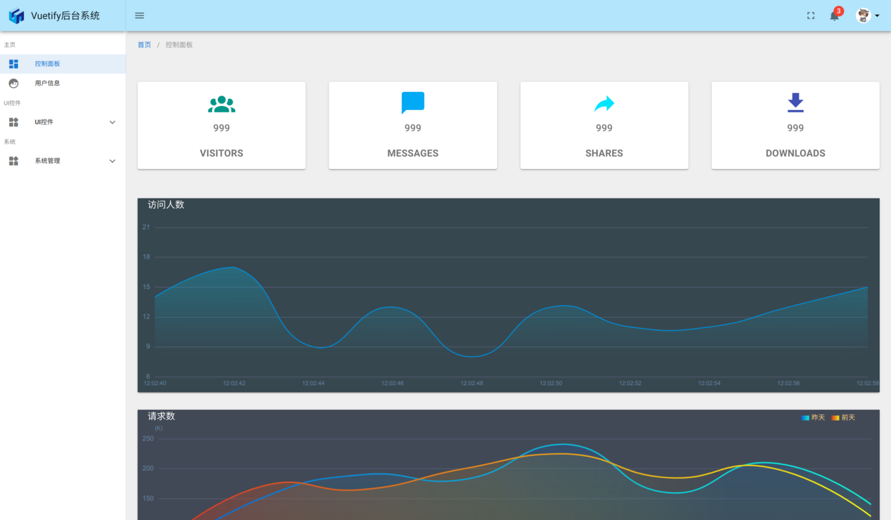
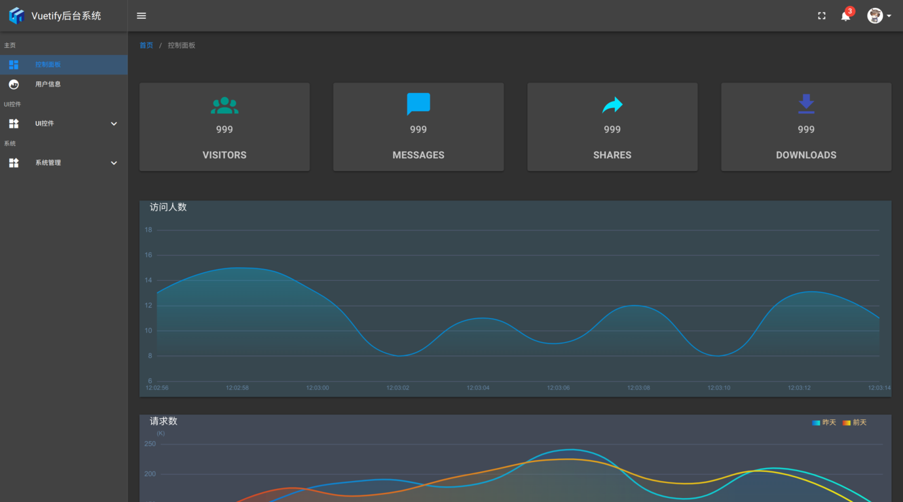

# vuetify-admin-ui

> Frontend Admin UI Based on Vue2 and Boostrap 4 with vuetify

## How to Start

### Use Yarn

* Project setup ` yarn install `

* Compiles and hot-reloads for development ` yarn run serve `

* Compiles and minifies for production `yarn run build`

### Use Npm

* set registry ` npm config set registry https://registry.npm.taobao.org `

* Project setup ` npm install `

* Compiles and hot-reloads for development ` npm run serve `

* Compiles and minifies for production `npm run build`

## Introduction

### ScreenShot

Login Page (中文)

Login Page (English)

Dashboard - Light Theme

Dashboard - Dark Theme

## Reference

Material Design Template

* [vue-admin-vuetify](https://github.com/vasttian/vue-admin-vuetify) is a Front-end component library project based on Vue.js using Vuetify.

* [vue-material-admin](https://github.com/tookit/vue-material-admin) is A vue material design admin template 

* [mdbootstrap](https://github.com/mdbootstrap/bootstrap-material-design) Material Design for Bootstrap - Powerful and free UI KIT for Bootstrap 4
